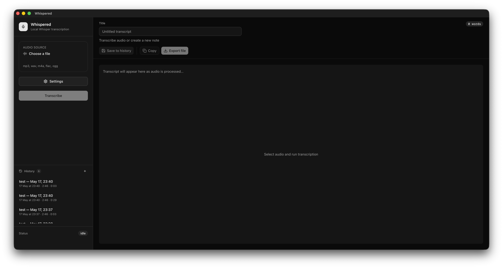
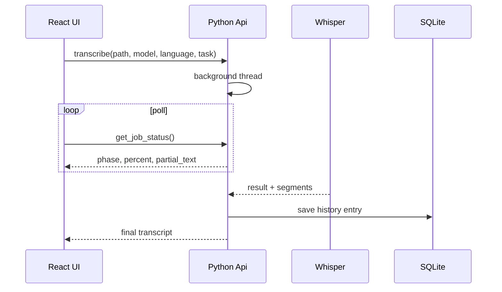

# Whispered

**Offline speech-to-text for your desktop.**  
Transcribe and translate audio with [OpenAI Whisper](https://github.com/openai/whisper) — no account, no upload, no local web server. One native window, one process.

[](https://github.com/lagemanngui/whispered/actions/workflows/build.yml)
[](LICENSE)
[](https://www.python.org/)
[](https://react.dev/)



---

## Why Whispered?

Most Whisper tools are either CLI-only or cloud-backed web apps. Whispered targets a different balance:

- **Private by default** — audio never leaves your machine
- **Polished UI** — pick a file, choose a model, edit and save the transcript
- **Shippable** — PyInstaller bundles Python, PyTorch, ffmpeg, and the UI for macOS, Windows, and Linux
- **Thoughtful UX** — live partial text while transcribing, transcript history, copy/export in one click

Built as a portfolio-grade desktop stack: **React + TypeScript** on the surface, **Python + Whisper** underneath, connected through **PyWebView**’s `js_api` bridge.

## Features

| Capability | Details |
|------------|---------|
| **Audio formats** | mp3, wav, m4a, flac, ogg, and more via bundled **ffmpeg** |
| **Models** | tiny → large, turbo, and English-only variants |
| **Languages** | Auto-detect or pick from a curated list |
| **Tasks** | Transcribe in the source language, or **translate to English** (model-dependent) |
| **Live progress** | Phase labels, percent, and growing partial transcript while decoding |
| **History** | SQLite-backed sidebar — reopen, rename, and delete past transcripts |
| **Export** | Copy to clipboard, save as `.txt`, or open in a full rich-text editor (formatting, task lists, images, links; save as HTML / Markdown / plain text) |
| **Packaging** | CI builds `.app` (macOS), `.exe` (Windows), and Linux folder; no end-user Python install |

## Download

Pre-built binaries are attached to [GitHub Releases](https://github.com/lagemanngui/whispered/releases) when you push a version tag (`v0.1.0`, etc.).

| Platform | Artifact |
|----------|----------|
| macOS | `Whispered.app` in `Whispered-<tag>-macos-arm64.zip` |
| Windows | `Whispered.exe` in `Whispered-<tag>-windows-x64.zip` |
| Linux | `Whispered` binary in `Whispered-<tag>-linux-x64.zip` (requires GTK 3 and WebKit2 4.1 on the system) |

First run downloads the selected Whisper model weights to `~/.cache/whisper`. Bundled installers are large (**~1–2 GB**) because they include PyTorch.

## Quick start (development)

**macOS** — one command:

```bash
chmod +x scripts/*.sh
./scripts/dev.sh
```

This fetches ffmpeg if needed, builds the frontend, creates a venv, installs Python deps, and launches the app.

<details>
<summary><strong>Manual setup (all platforms)</strong></summary>

**Requirements:** Python 3.10–3.12, Node.js 20+, macOS or Windows for packaging.

```bash
# 1. Bundled ffmpeg
./scripts/fetch-ffmpeg.sh          # macOS / Linux
# powershell -File scripts/fetch-ffmpeg.ps1   # Windows

# 2. Frontend
cd frontend && npm install && npm run build && cd ..

# 3. Python
python3 -m venv .venv
source .venv/bin/activate          # Windows: .venv\Scripts\activate
pip install -r requirements.txt

export PYTHONPATH="$(pwd)"         # Windows: set PYTHONPATH=%CD%
python run.py
```

</details>

## Build installers locally

**macOS**

```bash
./scripts/package-mac.sh
# → dist/Whispered.app
```

**Windows**

```powershell
.\scripts\package-win.ps1
# → dist\Whispered\Whispered.exe
```

**Linux**

```bash
./scripts/package-linux.sh
# → dist/Whispered/Whispered
```

Build on the OS you are targeting. See [docs/ARCHITECTURE.md](docs/ARCHITECTURE.md) for how PyInstaller and bundled assets are laid out.

## How it works



The UI calls `window.pywebview.api.*` (see `frontend/src/bridge.ts`). Transcription runs off the main thread; ffmpeg is on `PATH` before Whisper decodes audio. Full design notes: **[Architecture →](docs/ARCHITECTURE.md)**

## Project structure

```
app/                 Python: API bridge, Whisper wrapper, SQLite history
frontend/            React + Vite UI (static build loaded from disk)
vendor/ffmpeg/       Platform ffmpeg binaries (fetched, not in git)
build/               PyInstaller spec
scripts/             dev.sh, packaging, ffmpeg fetch
docs/                Architecture and images
.github/workflows/   Cross-platform CI and release uploads
```

## Tech stack

- **[Whisper](https://github.com/openai/whisper)** — speech recognition
- **[PyWebView](https://pywebview.flowrl.com/)** — native window + JS ↔ Python bridge
- **[React](https://react.dev/)** + **[Vite](https://vitejs.dev/)** + **[Tailwind CSS](https://tailwindcss.com/)**
- **[PyInstaller](https://pyinstaller.org/)** — distributable binaries
- **SQLite** — local transcript history

## Contributing

Contributions are welcome. Read **[CONTRIBUTING.md](CONTRIBUTING.md)** for setup, PR expectations, and bug report templates.

## License

This project is licensed under the **[MIT License](LICENSE)**.

Third-party notes:

- [OpenAI Whisper](https://github.com/openai/whisper) and model weights — MIT
- ffmpeg builds from [BtbN/FFmpeg-Builds](https://github.com/BtbN/FFmpeg-Builds) — GPL (bundled for decoding only; see upstream license for redistribution terms)

## Author

**Guilherme Dias** — [github.com/lagemanngui](https://github.com/lagemanngui)

If Whispered is useful to you, a star on the repo helps others discover it.
