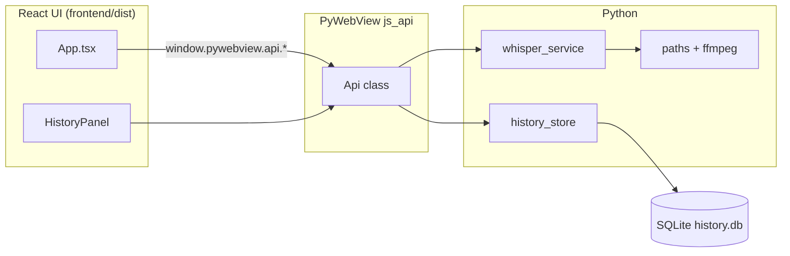

# Architecture

Whispered is a single-process desktop application: a native window hosts a static React UI, and Python handles transcription, file I/O, and persistence. There is no HTTP server and no cloud dependency for core functionality.

## High-level flow

## Layers

### Presentation (`frontend/`)

- **Vite + React 19 + TypeScript** — built to static assets in `frontend/dist/`.
- **Tailwind CSS 4 + Radix/shadcn-style components** — consistent, accessible UI primitives.
- **`bridge.ts`** — wraps `pywebview.api` calls, polling for job status during transcription.
- Loaded via `file://` URI from disk (see `app/paths.py` → `index_html()`).

### Bridge (`app/api.py`)

The `Api` class is exposed to JavaScript as `window.pywebview.api`. Responsibilities:

| Area | Methods (examples) | Notes |
|------|-------------------|--------|
| Models & config | `get_models`, `get_languages`, `get_ffmpeg_status` | Model metadata from `whisper_service` |
| Files | `pick_audio_file`, `get_audio_info`, `save_file`, `save_transcript` | Native dialogs via PyWebView; `save_file` supports HTML, Markdown, and text |
| Jobs | `transcribe`, `get_job_status`, `reset_job` | Background thread; UI polls status |
| History | `list_history`, `create_history`, `update_history`, `delete_history` | SQLite-backed transcripts |
| Clipboard | `copy_to_clipboard` | OS clipboard integration |

Transcription runs on a **daemon thread** so the UI stays responsive. Progress updates flow through `_on_progress` into `_job_state`, which `get_job_status` reads.

### Transcription (`app/whisper_service.py`)

- Wraps [OpenAI Whisper](https://github.com/openai/whisper) with a cached loaded model (reload only when model id changes).
- Emits phased progress: loading weights, decoding audio, segment-by-segment partial text during verbose output.
- Supports **transcribe** and **translate** tasks where the model allows translation (not all models support it — e.g. `turbo` does not).

Model weights download on first use to the standard Whisper cache (`~/.cache/whisper`).

### Persistence (`app/history_store.py`)

- SQLite database at `{user_data_dir}/history.db`.
- Stores transcript text, metadata (model, language, task, detected language), optional segment JSON, and file stats (duration, size, transcribe duration).
- Schema migrations via `PRAGMA table_info` + `ALTER TABLE` for additive columns.

### Paths & packaging (`app/paths.py`, `build/`)

- **Development**: project root, `frontend/dist`, `vendor/ffmpeg/{platform}/ffmpeg`.
- **Frozen (PyInstaller)**: `_MEIPASS` for bundled resources; ffmpeg prepended to `PATH` before Whisper loads audio.
- Platform dirs: `mac-arm64`, `mac-x64`, `win64` (see `scripts/fetch-ffmpeg.*`).

### Entry point (`app/main.py`, `run.py`)

`run.py` delegates to `app.main.main()`, which initializes paths, opens the history DB, validates the frontend build, and starts `webview.create_window` with `js_api=Api()`.

## CI / releases

GitHub Actions (`.github/workflows/build.yml`):

- Matrix build on **macOS**, **Windows**, and **Linux**
- Fetches ffmpeg, builds frontend, runs PyInstaller
- Uploads platform artifacts; tagged pushes (`v*`) publish Windows, macOS, and Linux zips to GitHub Releases

Expect **large artifacts** (~1–2 GB) because PyTorch ships with the bundle.

## Design decisions

| Choice | Rationale |
|--------|-----------|
| PyWebView instead of Electron | Smaller footprint; Python already required for Whisper |
| No local HTTP server | Simpler security model; `file://` + `js_api` is enough |
| SQLite for history | Offline-first, no setup, easy backup (single file) |
| Bundled ffmpeg | End users should not install codecs manually |
| Poll-based job status | Simple bridge without WebSocket complexity |

## Extension ideas

Reasonable future work (not necessarily planned):

- Linux packaging and ffmpeg target
- Export formats (SRT/VTT from stored segments)
- GPU device selection in settings
- Keyboard shortcuts and accessibility audit

See [CONTRIBUTING.md](../CONTRIBUTING.md) if you want to implement any of these.
